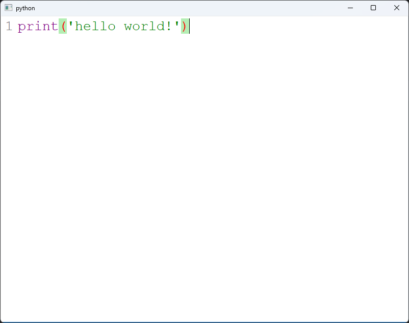

# PyQCodeEditor

A simple code edit widget for pyside and pyqt (qtpy).

## Description
This is a python implementation of the QCodeEditor（written in C++ Qt）. 
This project uses qtpy as the abstract layer of different python bindings of Qt, so that the user can choose whatever
python binding of qt they want, like pyqt5、pyqt6、pyside2、pyside6.

The original QCodeEditor can be found here: https://github.com/Megaxela/QCodeEditor.

## Status

### Now the following features are implemented:

1. Auto parentheses.
2. Different highlight rules.
3. Auto indentation.
4. Replace tabs with spaces.
5. Some builtin completion and highlight rules
6. Support custom themes and styles
7. Pure python, No C++ code

**Completers for:**
1. [C++](pyqcodeeditor/completers/QCXXCompleter.py)
2. [Python](pyqcodeeditor/completers/QPythonCompleter.py)
3. [Lua](pyqcodeeditor/completers/QLuaCompleter.py)

**Highlighters for:**
1. [C++](pyqcodeeditor/highlighters/QCXXHighlighter.py)
2. [Python](pyqcodeeditor/highlighters/QPythonHighlighter.py)
3. [Json](pyqcodeeditor/highlighters/QJSONHighlighter.py)
4. [Lua](pyqcodeeditor/highlighters/QLuaHighlighter.py)


### Unimplemented and known bugs:

- Frame selection (I write the python according to the original C++ code, but some bugs are occurred and 
I don't know why and how fix it for now)

- Highlighting python's multi-line string and c++'s multi-line comment are not fully behave as expected
(again I don't time to look into it and find a workaround now, any help is welcome)

### Different from QCodeEditor:

- The styles and language rules are defined in json instead of xml


**Note: This is not a fully featured IDE or code editor like VS Code**

## Get-Started

### Install this library

```bash
pip install PyQCodeEditor
```

### Install the python binding of QT you want, for example, PySide2

```bash
pip install pyside2
```

### Import QCodeEditor and use it as any regular qt widget:

```python
from qtpy.QtWidgets import QApplication
from pyqcodeeditor.QCodeEditor import QCodeEditor
from pyqcodeeditor.highlighters.QPythonHighlighter import QPythonHighlighter
from pyqcodeeditor.completers.QPythonCompleter import QPythonCompleter

app = QApplication([])
editor = QCodeEditor()
editor.setHighlighter(QPythonHighlighter())
editor.setCompleter(QPythonCompleter())
editor.resize(800, 600)
editor.setPlainText("print('hello world!')")
editor.show()
app.exec_()

```

Here is a screenshot of the above code:




## License

This lib itself is under the MIT license, but user should also comply with the license of
the qt binding lib they choose.  For example, if the user uses PyQT5, they should comply with the GPL license, if they chooses the PySide2 they should comply with the LGPL license, and so on